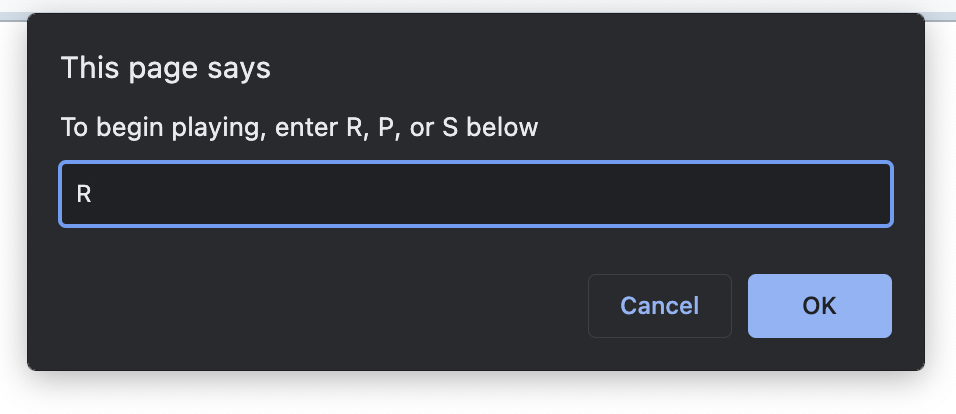
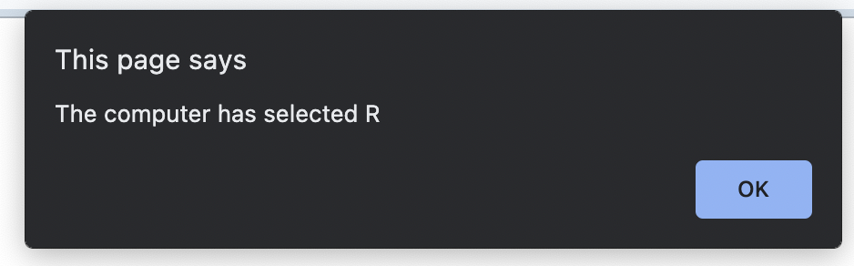
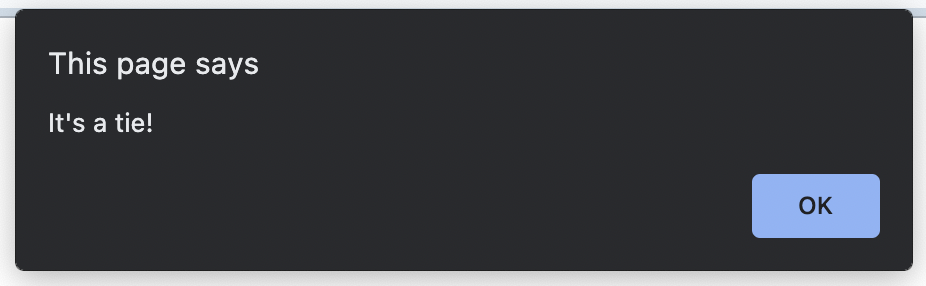
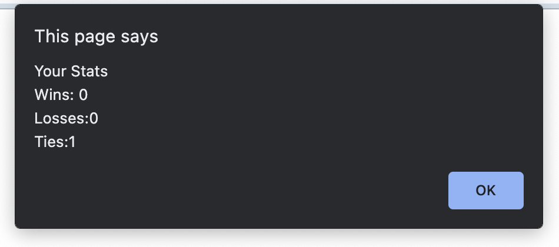
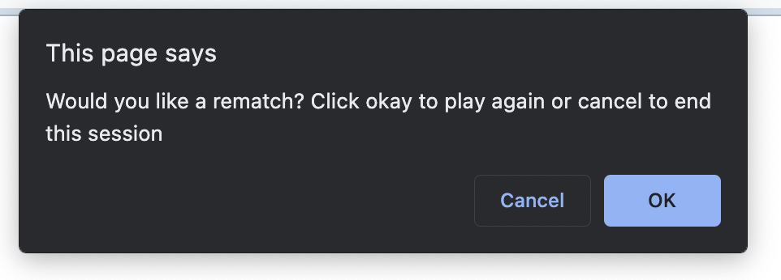

# Rock-Paper-Scissors

## About
This application was created using Javascript. This is a simple game of rock, paper, scissors against the application. Players make their selection and it is compared with the application's random selection. The player's statistics are stored and displayed.

## How To
[Deployed Application](https://bralvis2.github.io/Rock-Paper-Scissors/)

In order to run this project, follow the link provided.
Once you've landed on the application, players will be prompted to begin playing by entering R, P, or S in the textbox. 

    

Next, the player will be alerted with the application's selection.

    

The player is then alerted with the results.

    

The player is then alerted with their statistics. 

    

Finally, the player has an option to play agian or end the game.

    

## Credits

* [MDN Web Docs on window.alert()](https://developer.mozilla.org/en-US/docs/Web/API/Window/alert)

* [MDN Web Docs on window.confirm()](https://developer.mozilla.org/en-US/docs/Web/API/Window/confirm)

* [MDN Web Docs on window.prompt()](https://developer.mozilla.org/en-US/docs/Web/API/Window/prompt)

* [MDN Web Docs on Math](https://developer.mozilla.org/en-US/docs/Web/JavaScript/Reference/Global_Objects/Math)

## License 🌍 
 

MIT © [Brenda Alvis](https://github.com/bralvis2)&nbsp;&middot;&nbsp;

Copyright (c) 2022

Permission is hereby granted, free of charge, to any person obtaining a copy of this software and associated documentation files (the "Software"), to deal in the Software without restriction, including without limitation the rights to use, copy, modify, merge, publish, distribute, sublicense, and/or sell copies of the Software, and to permit persons to whom the Software is furnished to do so, subject to the following conditions:

The above copyright notice and this permission notice shall be included in all copies or substantial portions of the Software.

THE SOFTWARE IS PROVIDED "AS IS", WITHOUT WARRANTY OF ANY KIND, EXPRESS OR IMPLIED, INCLUDING BUT NOT LIMITED TO THE WARRANTIES OF MERCHANTABILITY, FITNESS FOR A PARTICULAR PURPOSE AND NONINFRINGEMENT. IN NO EVENT SHALL THE AUTHORS OR COPYRIGHT HOLDERS BE LIABLE FOR ANY CLAIM, DAMAGES OR OTHER LIABILITY, WHETHER IN AN ACTION OF CONTRACT, TORT OR OTHERWISE, ARISING FROM, OUT OF OR IN CONNECTION WITH THE SOFTWARE OR THE USE OR OTHER DEALINGS IN THE SOFTWARE.